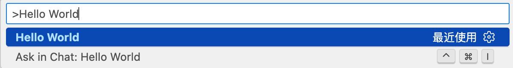
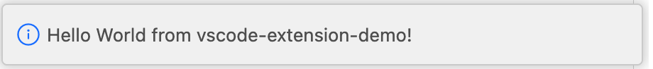
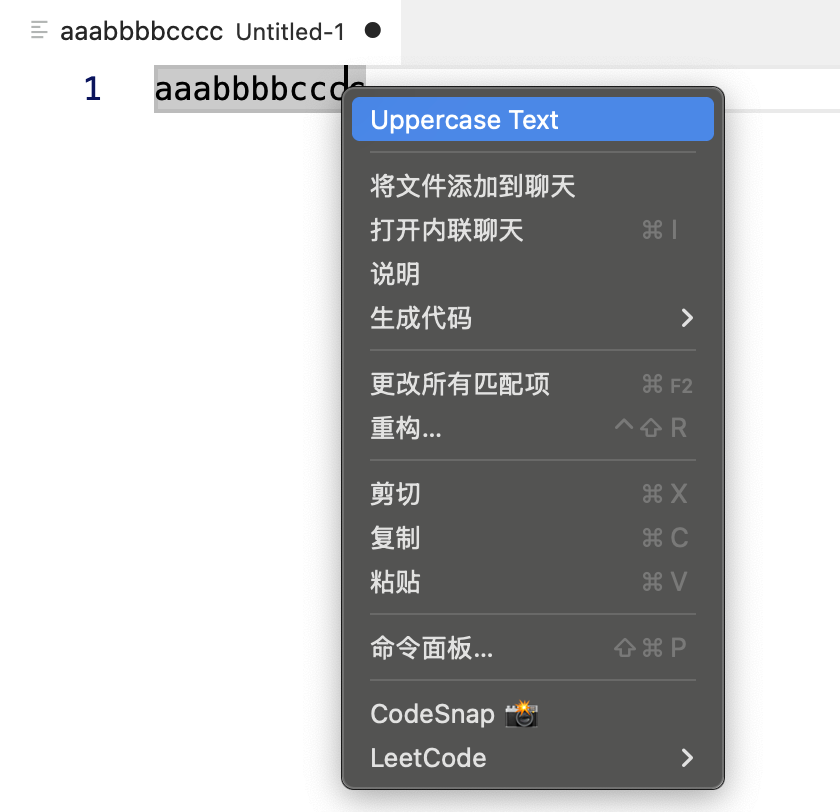

# VS Code 插件开发

VS Code 扩展是基于 Electron + TypeScript/JavaScript 的 Node.js 应用，通过官方 `vscode` API 与编辑器内核交互，所有功能通过「声明式配置 + 编程式 API」实现。

## 安装扩展开发脚手架并初始化项目

VS Code 官方提供 `yo` + `generator-code` 脚手架一键生成扩展模板

```bash
# 全局安装脚手架
npm install -g yo generator-code

# 验证安装
yo --version && code --version
```

生成第一个扩展项目 `vscode-extension-demo`

```bash
yo code

What type of extension do you want to create? --- New Extension（TypeScript）
what`s the name of your extension? --- vscode-extension-demo
what`s the identifier of your extension? --- vscode-extension-demo
what`s the description of your extension? --- vscode 插件学习
Initialize a git repository? --- Y
Which bundler to use? --- Webpack
Which package manager to use? --- npm
```

VS Code 扩展工程核心目录结构：

```plaintext
vscode-extension-demo/
├── .vscode/           # 扩展开发调试配置（自动生成）
│   ├── launch.json    # 调试配置（启动/调试扩展）
│   └── tasks.json     # 编译TS任务
├── src/
│   └── extension.ts   # 扩展核心逻辑（入口文件）
├── package.json       # 扩展配置清单（核心！声明贡献点/依赖/激活条件）
├── tsconfig.json      # TS配置
└── README.md
```

## 运行 Hello World 

打开 `src/extension.ts` 解读代码

```typescript
// 模块 'vscode' 包含 VS Code 的扩展 API
import * as vscode from "vscode"

// 扩展激活入口，编辑器触发激活条件时执行
export function activate(context: vscode.ExtensionContext) {
  // 这行代码只会在扩展激活时执行一次
  // 使用控制台输出诊断信息（`console.log`）和错误（`console.error`）
  console.log('Congratulations, your extension "vscode-extension-demo" is now active!')

  // 注册命令：命令 ID 需与 package.json 中的 contributes.commands 一致
  const disposable = vscode.commands.registerCommand(
    "vscode-extension-demo.helloWorld",
    () => {
      // 弹出提示框
      vscode.window.showInformationMessage("Hello World from vscode-extension-demo!")
    }
  )

  // 将命令添加到上下文：确保扩展销毁时释放资源
  context.subscriptions.push(disposable)
}

// 扩展销毁时执行（可选，清理资源/取消监听）
export function deactivate() {}
```

打开扩展项目的 `.vscode/launch.json`（脚手架自动生成），核心配置如下（无需修改，确认存在即可）

```json
{
  "version": "0.2.0",
  "configurations": [
    {
      "name": "Run Extension", // 调试名称
      "type": "extensionHost", // 类型：扩展宿主（核心！）
      "request": "launch",
      "args": [
        "--extensionDevelopmentPath=${workspaceFolder}" // 关键：指定当前扩展目录
      ],
      "outFiles": ["${workspaceFolder}/out/**/*.js"], // TS编译后的JS文件路径
      "preLaunchTask": "${defaultBuildTask}" // 启动前自动编译TS（避免加载未编译代码）
    }
  ]
}
```

加载扩展并运行 `Hello World`

1. 打开扩展项目根目录（确保 VS Code 工作区是扩展项根目录，而非子目录）
2. 打开左侧「运行和调试」面板 -> 选择 「Run Extension」 -> 点击启动按钮（或者按 `F5`）
3. 等待几秒后，会自动弹出「扩展开发宿主」窗口，标题栏会标注 Extension Development Host
4. 扩展已加载到该窗口中，执行扩展命令 `Cmd+Shift+P` 打开命令面板，输入 `Hello World`，执行后弹出提示框，验证成功





核心配置 `package.json` 解读，`package.json` 是扩展的 「身份证 + 功能清单」，核心字段：

```json
{
  "name": "enterprise-extension",       // 扩展名称（发布到市场需唯一）
  "displayName": "Enterprise Extension",// 展示名称
  "version": "0.0.1",                   // 版本号（语义化版本）
  "engines": { "vscode": "^1.80.0" },   // 兼容的VS Code版本（企业级需测试多版本）
  "main": "./out/extension.js",         // 编译后的入口文件
  "activationEvents": [                 // 扩展激活时机（企业级需精准控制，避免过早加载）
    "onCommand:enterprise-extension.helloWorld" // 执行指定命令时激活
  ],
  "contributes": {                      // 贡献点：声明扩展提供的功能（核心！）
    "commands": [                       // 注册命令
      {
        "command": "enterprise-extension.helloWorld",
        "title": "Hello World"
      }
    ]
  },
  "devDependencies": {                  // 开发依赖（TS编译/类型声明等）
    "@types/vscode": "^1.80.0",         // VS Code API类型声明（必须与engines.vscode匹配）
    "@types/node": "16.x",
    "typescript": "^5.1.6",
    "eslint": "^8.44.0"
  }
}
```

## 注册自定义指令并挂载到菜单中

该指令可以格式化选中内容，将英文小写转为大写

:::code-group

```typescript[extension.ts]
// 注册指令格式化代码
const upperTextDisposable = vscode.commands.registerCommand(
  "vscode-extension-demo.upperText",
  () => {
    // 获取当前活动的文本编辑器
    const editor = vscode.window.activeTextEditor

    if (!editor) {
      vscode.window.showInformationMessage("No active editor found!")
      return
    }

    const selection = editor.selection
    const text = editor.document.getText(selection)
    const upperText = text.toUpperCase()

    // 编辑文档（需通过edit方法，VS Code统一管理编辑事务）
    editor.edit((editBuilder) => {
      editBuilder.replace(selection, upperText)
    })
  }
)

context.subscriptions.push(upperTextDisposable)
```

```json[package.json]
{
  "contributes": {
    // 注册指令
    "commands": [
      {
        "command": "vscode-extension-demo.upperText",
        "title": "Uppercase Text"
      },
    ],
    // 将命令挂载到菜单中
    "menus": {
      "editor/context": [
        {
          "command": "vscode-extension-demo.upperText",
          "when": "editorTextFocus",
          "group": "navigation"
        }
      ]
    }
  }
}
```
:::



## Webview 面板

嵌入自定义 HTML/CSS/JS 页面

:::code-group

```typescript[extension.ts]
// 注册打开页面指令
const openWebviewDisposable = vscode.commands.registerCommand(
  "vscode-extension-demo.openWebview",
  () => {
    // 创建并显示一个新的 Webview 面板
    const panel = vscode.window.createWebviewPanel(
      "webviewDemo", // 面板标识
      "Webview Demo", // 面板标题
      vscode.ViewColumn.One, // 显示在编辑器的哪个列
      {
        enableScripts: true, // 允许执行JS（必须），否则无法执行 acquireVsCodeApi()
        retainContextWhenHidden: true, // 隐藏时保留上下文
      }
    )

    // 设置 Webview 的 HTML 内容
    panel.webview.html = getWebviewContent()
  }
)

// 将命令添加到上下文：确保扩展销毁时释放资源
context.subscriptions.push(openWebviewDisposable)

// 获取 Webview 的 HTML 内容
function getWebviewContent() {
  return `<!DOCTYPE html>
    <html lang="en">
      <head>
          <meta charset="UTF-8">
          <meta name="viewport" content="width=device-width, initial-scale=1.0">
          <title>Webview Demo</title>
      </head>
      <body>
          <h1>Hello from Webview!</h1>
          <p>This is a simple webview example in VS Code extension.</p>
      </body>
    </html>`
}
```

```json[package.json]
{
  "contributes": {
    // 注册指令
    "commands": [
      {
        "command": "vscode-extension-demo.openWebview",
        "title": "Open Webview"
      },
    ],
  }
}
```
:::


## Webview 与扩展主进程双向通信

Webview 运行在独立的上下文环境中，与扩展进程（Node.js环境）无法直接共享数据，需要通过 `postMessage/onDidReceiveMessage` 实现双向通信，核心是基于 JSON 格式的消息传递。

- 扩展主进程 -> Webview：扩展主进程通过 `webviewPanel.webview.postMessage()` 向 Webview 发送数据；
- Webview -> Webview 中通过 `acquireVsCodeApi()` 获取 VS Code 桥接对象，调用 `PostMessage` 向主进程发送数据；
- 双方通过监听消息事件，解析消息类型和数据完成逻辑响应。

修改之前写的 open.webview 指令，实现 webview 与扩展主进程之间的通信

:::code-group
```typescript[extension.ts]
export function activate(context: vscode.ExtensionContext) {
  ...
  // 注册打开页面指令
  const openWebviewDisposable = vscode.commands.registerCommand(
    "vscode-extension-demo.openWebview",
    () => {
      // 1.创建并显示一个新的 Webview 面板
      const panel = vscode.window.createWebviewPanel(
        "webviewDemo", // 面板标识
        "Webview Demo", // 面板标题
        vscode.ViewColumn.One, // 显示在编辑器的哪个列
        {
          enableScripts: true, // 允许执行JS（必须），否则无法执行 acquireVsCodeApi()
          retainContextWhenHidden: true, // 隐藏时保留上下文
          localResourceRoots: [
            vscode.Uri.file(context.extensionPath + '/webview')
          ], // 允许 webview 访问扩展目录下的资源
        }
      )

      // 2. 主进程监听Webview发送的消息
      panel.webview.onDidReceiveMessage(
        (message) => {
          switch (message.type) {
            case 'getData':
              // 响应Webview的「获取数据」请求
              panel.webview.postMessage({
                type: 'dataResponse',
                data: {
                  name: 'VS Code Webview',
                  version: '1.0.0',
                  time: new Date().toLocaleString()
                }
              });
              break;
            case 'saveData':
              // 处理Webview提交的「保存数据」请求
              console.log('Webview提交的数据：', message.payload);
              // 可调用Node.js API写入文件/数据库
              vscode.window.showInformationMessage('数据保存成功：' + JSON.stringify(message.payload));
              break;
          }
        },
        undefined,
        context.subscriptions // 加入销毁队列，避免内存泄漏
      );

      // 3.设置 Webview 的 HTML 内容
      panel.webview.html = getWebviewContent(panel.webview, context)
    }
  )

  // 将命令添加到上下文：确保扩展销毁时释放资源
  context.subscriptions.push(openWebviewDisposable)
}

// 获取 Webview 的 HTML 内容
function getWebviewContent(webview: vscode.Webview, context: vscode.ExtensionContext): string {
  // 将本地资源路径转换为 webview 可以访问的 URI
  const scriptUri = webview.asWebviewUri(
    vscode.Uri.file(context.extensionPath + '/webview/main.js')
  )
  console.log('scriptUri', scriptUri);
  return `
    <!DOCTYPE html>
    <html lang="zh-CN">
    <head>
      <meta charset="UTF-8">
      <title>Webview交互示例</title>
      <style>body { padding: 20px; font-size: 14px; }</style>
    </head>
    <body>
      <h3>Webview与主进程交互</h3>
      <button id="getBtn">获取主进程数据</button>
      <button id="saveBtn">提交数据到主进程</button>
      <div id="result" style="margin-top: 20px; color: #666;"></div>
      <script src="${scriptUri}"></script>
    </body>
    </html>
  `
}
```

```javascript [main.js]
// 获取 VS Code 桥接对象（全局唯一，仅能调用一次）
const vscode = acquireVsCodeApi();

// 1. Webview向主进程发送「获取数据」请求
document.getElementById('getBtn').addEventListener('click', () => {
  console.log('发送获取数据请求');
  vscode.postMessage({
    type: 'getData', // 消息类型，用于主进程区分逻辑
    payload: {} // 可选：携带给主进程的参数
  });
});

// 2. Webview向主进程发送「保存数据」请求
document.getElementById('saveBtn').addEventListener('click', () => {
  vscode.postMessage({
    type: 'saveData',
    payload: {
      username: 'test',
      content: 'Webview提交的测试数据'
    }
  });
});

// 3. 监听主进程发送的消息
window.addEventListener('message', (event) => {
  const message = event.data;
  switch (message.type) {
    case 'dataResponse':
      // 渲染主进程返回的数据
      document.getElementById('result').innerHTML = JSON.stringify(message.data, null, 2);
      break;
  }
});
```
:::

## 发布


## 总结

本文介绍了

