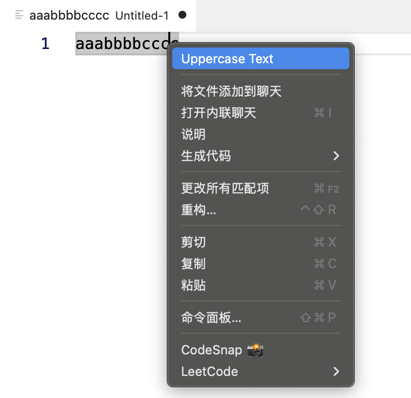

# 命令

## 使用命令

VS Code 包含大量内置命令，可以使用这些命令与编辑器交互、控制用户界面或执行后台操作。

### 以编程方式执行命令

(vscode.commands.executeCommand)[https://code.visualstudio.com/api/references/vscode-api#commands.executeCommand]接口可以编程方式执行命令。借助该接口，可以调用 VS Code 的内置功能，还能基于各类扩展进行开发，比如 VS Code 自带的 Git 扩展和 Markdown 扩展。

例如 `editor.action.addCommentLine` 命令对活动文本编辑器中当前选定的行进行注释：

```ts
import * as vscode from 'vscode';

function commentLine() {
  vscode.commands.executeCommand('editor.action.addCommentLine');
}
```

部分命令可以传参，也会返回结果。例如 `vscode.executeDefinitionProvider` 这类接口式命令，可查询文档中指定位置的代码定义。
它接收文档统一资源标识符（URI）和光标位置作为参数，并返回一个包含定义列表的 Promise 对象。

```ts
import * as vscode from 'vscode';

async function printDefinitionsForActiveEditor() {
  const activeEditor = vscode.window.activeTextEditor;
  if (!activeEditor) {
    return;
  }

  const definitions = await vscode.commands.executeCommand<vscode.Location[]>(
    'vscode.executeDefinitionProvider',
    activeEditor.document.uri,
    activeEditor.selection.active
  );

  for (const definition of definitions) {
    console.log(definition);
  }
}
```

### 命令式 URI

命令 URI 是可执行指定命令的链接，能够悬浮提示文本、补全项详情或网页视图中作为可点击链接使用。

命令 URI 以 `command` 协议开头，后接命令名称。例如编辑器行注释命令 `editor.action.addCommentLine`，对应的命令 URI 为 `command:editor.action.addCommentLine`。

这是一个悬浮提示器，可以在当前激活文本编辑器的行注释区域展示跳转链接

```ts
import * as vscode from 'vscode';

export function activate(context: vscode.ExtensionContext) {
  vscode.languages.registerHoverProvider(
    'javascript',
    new (class implements vscode.HoverProvider {
      provideHover(
        _document: vscode.TextDocument,
        _position: vscode.Position,
        _token: vscode.CancellationToken
      ): vscode.ProviderResult<vscode.Hover> {
        const commentCommandUri = vscode.Uri.parse(`command:editor.action.addCommentLine`);
        const contents = new vscode.MarkdownString(`[Add comment](${commentCommandUri})`);

        // To enable command URIs in Markdown content, you must set the `isTrusted` flag.
        // When creating trusted Markdown string, make sure to properly sanitize all the
        // input content so that only expected command URIs can be executed
        contents.isTrusted = true;

        return new vscode.Hover(contents);
      }
    })()
  );
}

```


# 注册自定义指令并挂载到菜单中

VS Code 扩展通过 `vscode.commands.registerCommand()` 注册自定义命令，并在 `package.json` 的 `contributes.commands` 中声明，通过 `contributes.menus` 将命令挂载到不同的菜单位置。

## 文本转大写

该指令可以格式化选中内容，将英文小写转为大写

:::code-group

```typescript [extension.ts]
// 注册指令格式化代码
const upperTextDisposable = vscode.commands.registerCommand(
  "vscode-extension-demo.upperText",
  () => {
    // 获取当前活动的文本编辑器
    const editor = vscode.window.activeTextEditor

    if (!editor) {
      vscode.window.showInformationMessage("No active editor found!")
      return
    }

    const selection = editor.selection
    const text = editor.document.getText(selection)
    const upperText = text.toUpperCase()

    // 编辑文档（需通过edit方法，VS Code统一管理编辑事务）
    editor.edit((editBuilder) => {
      editBuilder.replace(selection, upperText)
    })
  }
)

context.subscriptions.push(upperTextDisposable)
```

```json[package.json]
{
  "contributes": {
    // 注册指令
    "commands": [
      {
        "command": "vscode-extension-demo.upperText",
        "title": "Uppercase Text"
      }
    ],
    // 将命令挂载到菜单中
    "menus": {
      "editor/context": [
        {
          "command": "vscode-extension-demo.upperText",
          "when": "editorTextFocus",
          "group": "navigation"
        }
      ]
    }
  }
}
```

:::



## 命令注册详解

### 1. 命令注册方法

`vscode.commands.registerCommand()` 方法签名：

```typescript
registerCommand(
  command: string,           // 命令ID（需与package.json中的command一致）
  callback: (...args: any[]) => any,  // 命令执行的回调函数
  thisArg?: any              // 可选：回调函数的this上下文
): vscode.Disposable
```

### 2. 命令参数传递

命令可以接收参数，参数可以通过以下方式传递：

- **命令面板调用**：不支持参数
- **快捷键调用**：不支持参数
- **编程式调用**：`vscode.commands.executeCommand('commandId', arg1, arg2)`

```typescript
// 注册带参数的命令
const commandWithArgs = vscode.commands.registerCommand(
  "vscode-extension-demo.commandWithArgs",
  (arg1: string, arg2: number) => {
    vscode.window.showInformationMessage(`参数1: ${arg1}, 参数2: ${arg2}`)
  }
)

// 在其他地方调用
vscode.commands.executeCommand(
  "vscode-extension-demo.commandWithArgs",
  "hello",
  123
)
```

### 3. 异步命令处理

命令回调可以返回 `Promise`，VS Code 会等待 Promise 完成：

```typescript
const asyncCommand = vscode.commands.registerCommand(
  "vscode-extension-demo.asyncCommand",
  async () => {
    // 显示进度提示
    await vscode.window.withProgress(
      {
        location: vscode.ProgressLocation.Notification,
        title: "处理中...",
        cancellable: false,
      },
      async (progress) => {
        progress.report({ increment: 0 })

        // 模拟异步操作
        await new Promise((resolve) => setTimeout(resolve, 2000))

        progress.report({ increment: 100 })
        vscode.window.showInformationMessage("处理完成！")
      }
    )
  }
)
```
