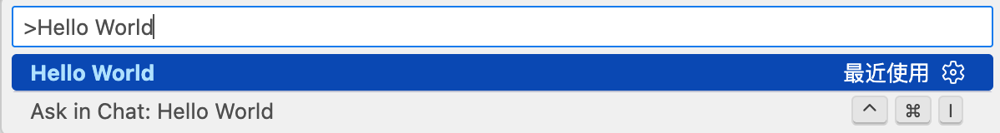

# VS Code 插件开发

VS Code 扩展是基于 Electron + TypeScript/JavaScript 的 Node.js 应用，通过官方 `vscode` API 与编辑器内核交互，所有功能通过「声明式配置 + 编程式 API」实现。

## 安装扩展开发脚手架并初始化项目

VS Code 官方提供 `yo` + `generator-code` 脚手架一键生成扩展模板

```bash
# 全局安装脚手架
npm install -g yo generator-code

# 验证安装
yo --version && code --version
```

生成第一个扩展项目 `helloworld`

```bash
yo code

# ? Do you want to open the new folder with Visual Studio Code? Open with `code`#
# What type of extension do you want to create? --- New Extension（TypeScript）
# what`s the name of your extension? --- vscode-extension-demo
# what`s the identifier of your extension? --- vscode-extension-demo
# what`s the description of your extension? --- vscode 插件学习
# Initialize a git repository? --- Y
# Which bundler to use? --- Webpack
# Which package manager to use? --- npm
```


## 运行 Hello World

加载扩展并运行 `Hello World`

1. 打开扩展项目根目录（确保 VS Code 工作区是扩展项根目录，而非子目录）
2. 打开左侧「运行和调试」面板 -> 选择 「Run Extension」 -> 点击启动按钮（或者按 `F5`）
3. 等待几秒后，会自动弹出「扩展开发宿主」窗口，标题栏会标注 Extension Development Host
4. 扩展已加载到该窗口中，执行扩展命令 `Cmd+Shift+P` 打开命令面板，输入 `Hello World`，执行后弹出提示框，验证成功




## Hello World 插件底层原理

Hello World 插件主要做了 3 件事：

- 注册 onCommand 激活事件：`onCommand:helloworld.helloworld`，当用于执行 Hello World 时，插件会被激活；
- 使用 `contributes.commands` 贡献点，让 Hello World 命令出现在命令面板中，并将其绑定到命令 ID `helloworld.helloworld`；
- 使用 VS Code API 的 `commands.registerCommand` 将一个函数绑定到已注册的命令 ID `helloworld.helloworld` 上；

### VS Code 扩展工程核心目录结构

```plaintext
vscode-extension-demo/
├── .vscode/           # 扩展开发调试配置（自动生成）
│   ├── launch.json    # 调试配置（启动/调试扩展）
│   └── tasks.json     # 编译TS任务
├── src/
│   └── extension.ts   # ❗️扩展主入口文件，编写命令的具体业务实现 
├── package.json       # ❗️扩展配置清单，用来声明插件信息和注册指令
├── tsconfig.json      # TS配置
└── README.md
```

### 解读 `src/extension.ts`

```typescript
// 模块 'vscode' 包含 VS Code 的扩展 API
import * as vscode from "vscode"

// 扩展激活入口，首次被激活会自动执行这个函数
export function activate(context: vscode.ExtensionContext) {
  console.log(
    'Congratulations, your extension "vscode-extension-demo" is now active!'
  )

  // 注册命令：命令 ID 需与 package.json 中的 contributes.commands 一致
  const disposable = vscode.commands.registerCommand(
    "vscode-extension-demo.helloWorld",
    () => {
      // 弹出提示框
      vscode.window.showInformationMessage(
        "Hello World from vscode-extension-demo!"
      )
    }
  )

  // 将命令添加到上下文：确保扩展销毁时释放资源
  context.subscriptions.push(disposable)
}

// 扩展销毁时执行（可选，清理资源/取消监听）
export function deactivate() {}
```

### 解读 `package.json`

核心配置 `package.json` 解读，`package.json` 是扩展的 「身份证 + 功能清单」，核心字段：

```json
{
  "name": "enterprise-extension", // 扩展名称（发布到市场需唯一）
  "displayName": "Enterprise Extension", // 展示名称
  "version": "0.0.1", // 版本号（语义化版本）
  "engines": { "vscode": "^1.80.0" }, // 兼容的VS Code版本（企业级需测试多版本）
  "main": "./out/extension.js", // 编译后的入口文件
  "activationEvents": [
    // 扩展激活时机（企业级需精准控制，避免过早加载）
    "onCommand:enterprise-extension.helloWorld" // 执行指定命令时激活
  ],
  "contributes": {
    // 贡献点：声明扩展提供的功能（核心！）
    "commands": [
      // 注册命令
      {
        "command": "enterprise-extension.helloWorld",
        "title": "Hello World"
      }
    ]
  },
  "devDependencies": {
    // 开发依赖（TS编译/类型声明等）
    "@types/vscode": "^1.80.0", // VS Code API类型声明（必须与engines.vscode匹配）
    "@types/node": "16.x",
    "typescript": "^5.1.6",
    "eslint": "^8.44.0"
  }
}
```
### 解读 `.vscode/launch.json`

打开扩展项目的 `.vscode/launch.json`（脚手架自动生成），核心配置如下（无需修改，确认存在即可）

```json
{
  "version": "0.2.0",
  "configurations": [
    {
      "name": "Run Extension", // 调试名称
      "type": "extensionHost", // 类型：扩展宿主（核心！）
      "request": "launch",
      "args": [
        "--extensionDevelopmentPath=${workspaceFolder}" // 关键：指定当前扩展目录
      ],
      "outFiles": ["${workspaceFolder}/out/**/*.js"], // TS编译后的JS文件路径
      "preLaunchTask": "${defaultBuildTask}" // 启动前自动编译TS（避免加载未编译代码）
    }
  ]
}
```

::: tip 练一练
1.尝试将 `Hello World from HelloWorld!` 提示语修改为 `Hello VS Code`

2.尝试将 `Hello World` 命令修改为 `Hello VS Code`

3.注册一个新的指令，并使用警告风格的提示语
:::
