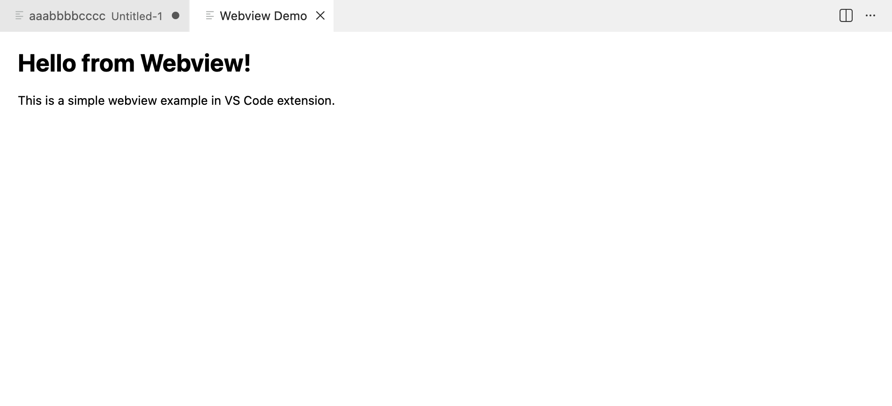

# 开发 Webview 面板

Webview 是 VS Code 扩展中用于嵌入自定义 HTML/CSS/JavaScript 页面的功能，允许开发者创建丰富的交互式界面。Webview 运行在独立的隔离环境中，与扩展主进程通过消息传递机制进行通信。

## 创建简单的 Webview

:::code-group

```typescript [extension.ts]
// 注册打开页面指令
const openWebviewDisposable = vscode.commands.registerCommand(
  "vscode-extension-demo.openWebview",
  () => {
    // 创建并显示一个新的 Webview 面板
    const panel = vscode.window.createWebviewPanel(
      "webviewDemo", // 面板标识（viewType）
      "Webview Demo", // 面板标题
      vscode.ViewColumn.One, // 显示在编辑器的哪个列
      {
        enableScripts: true, // 允许执行JS（必须），否则无法执行 acquireVsCodeApi()
        retainContextWhenHidden: true, // 隐藏时保留上下文
      }
    )

    // 设置 Webview 的 HTML 内容
    panel.webview.html = getWebviewContent()
  }
)

// 将命令添加到上下文：确保扩展销毁时释放资源
context.subscriptions.push(openWebviewDisposable)

// 获取 Webview 的 HTML 内容
function getWebviewContent() {
  return `<!DOCTYPE html>
    <html lang="en">
      <head>
          <meta charset="UTF-8">
          <meta name="viewport" content="width=device-width, initial-scale=1.0">
          <title>Webview Demo</title>
      </head>
      <body>
          <h1>Hello from Webview!</h1>
          <p>This is a simple webview example in VS Code extension.</p>
      </body>
    </html>`
}
```

```json [package.json]
{
  "contributes": {
    "commands": [
      {
        "command": "vscode-extension-demo.openWebview",
        "title": "Open Webview"
      }
    ]
  }
}
```

:::



## createWebviewPanel API 详解

`vscode.window.createWebviewPanel()` 是创建 Webview 面板的核心 API，其方法签名如下：

```typescript
createWebviewPanel(
  viewType: string,              // 面板类型标识（唯一）
  title: string,                 // 面板标题
  showOptions: ViewColumn | { viewColumn: ViewColumn; preserveFocus?: boolean }, // 显示位置
  options?: WebviewPanelOptions & WebviewOptions // 配置选项
): WebviewPanel
```

### 参数说明

#### 1. viewType（面板类型标识）

- **类型**：`string`
- **说明**：面板的唯一标识符，用于区分不同类型的 Webview 面板
- **示例**：`"webviewDemo"`、`"customPanel"`

#### 2. title（面板标题）

- **类型**：`string`
- **说明**：显示在面板标签页上的标题
- **示例**：`"Webview Demo"`、`"配置面板"`

#### 3. showOptions（显示位置）

- **类型**：`ViewColumn | { viewColumn: ViewColumn; preserveFocus?: boolean }`
- **说明**：控制面板在哪个编辑器列中显示
- **选项**：
  - `ViewColumn.One`：第一列
  - `ViewColumn.Two`：第二列
  - `ViewColumn.Three`：第三列
  - `ViewColumn.Active`：当前活动列
  - `ViewColumn.Beside`：当前活动列旁边
  - `{ viewColumn: ViewColumn.One, preserveFocus: true }`：显示但不获取焦点

#### 4. options（配置选项）

```typescript
interface WebviewPanelOptions {
  enableScripts?: boolean // 是否启用 JavaScript（默认 false）
  retainContextWhenHidden?: boolean // 隐藏时是否保留上下文（默认 false）
  localResourceRoots?: ReadonlyArray<Uri> // 允许访问的本地资源根目录
  enableFindWidget?: boolean // 是否启用查找小部件（默认 false）
  enableCommandUris?: boolean // 是否启用命令 URI（默认 false）
}
```

**重要配置说明**：

- **`enableScripts: true`**：必须设置为 `true`，否则无法在 Webview 中使用 `acquireVsCodeApi()`
- **`retainContextWhenHidden: true`**：面板隐藏时保留 JavaScript 状态，适合需要保持状态的复杂应用
- **`localResourceRoots`**：指定 Webview 可以访问的本地资源目录，用于加载外部 CSS、JS、图片等文件

## Webview 与扩展主进程双向通信

Webview 运行在独立的隔离环境中，与扩展主进程（Node.js 环境）无法直接共享数据或调用函数。因此，需要通过 **消息传递机制** 实现双向通信，核心是基于 JSON 格式的消息传递。

- **扩展主进程 → Webview**：通过 `webviewPanel.webview.postMessage()` 向 Webview 发送数据
- **Webview → 主进程**：通过 `acquireVsCodeApi()` 获取 VS Code 桥接对象，调用 `postMessage()` 向主进程发送数据
- **消息监听**：双方通过监听消息事件，解析消息类型和数据完成逻辑响应

下面是一个完整的双向通信示例，实现 Webview 与主进程之间的数据交互：

:::code-group

```typescript [extension.ts]
export function activate(context: vscode.ExtensionContext) {
  // 注册打开页面指令
  const openWebviewDisposable = vscode.commands.registerCommand(
    "vscode-extension-demo.openWebview",
    () => {
      // 1. 创建并显示一个新的 Webview 面板
      const panel = vscode.window.createWebviewPanel(
        "webviewDemo",
        "Webview Demo",
        vscode.ViewColumn.One,
        {
          enableScripts: true, // 必须启用，否则无法使用 acquireVsCodeApi()
          retainContextWhenHidden: true, // 隐藏时保留上下文
          localResourceRoots: [
            vscode.Uri.file(context.extensionPath + "/webview-resources"),
          ], // 允许 webview 访问扩展目录下的资源
        }
      )

      // 2. 主进程监听 Webview 发送的消息
      panel.webview.onDidReceiveMessage(
        (message) => {
          switch (message.type) {
            case "getData":
              // 响应 Webview 的「获取数据」请求
              panel.webview.postMessage({
                type: "dataResponse",
                data: {
                  name: "VS Code Webview",
                  version: "1.0.0",
                  time: new Date().toLocaleString(),
                },
              })
              break
            case "saveData":
              // 处理 Webview 提交的「保存数据」请求
              console.log("Webview提交的数据：", message.payload)
              // 可调用 Node.js API 写入文件/数据库
              vscode.window.showInformationMessage(
                "数据保存成功：" + JSON.stringify(message.payload)
              )
              break
          }
        },
        undefined,
        context.subscriptions // 加入销毁队列，避免内存泄漏
      )

      // 3. 设置 Webview 的 HTML 内容
      panel.webview.html = getWebviewContent(panel.webview, context)
    }
  )

  // 将命令添加到上下文：确保扩展销毁时释放资源
  context.subscriptions.push(openWebviewDisposable)
}

// 获取 Webview 的 HTML 内容
function getWebviewContent(
  webview: vscode.Webview,
  context: vscode.ExtensionContext
): string {
  // 将本地资源路径转换为 webview 可以访问的 URI
  const scriptUri = webview.asWebviewUri(
    vscode.Uri.file(context.extensionPath + "/webview-resources/main.js")
  )
  return `
    <!DOCTYPE html>
    <html lang="zh-CN">
    <head>
      <meta charset="UTF-8">
      <meta name="viewport" content="width=device-width, initial-scale=1.0">
      <title>Webview交互示例</title>
      <style>
        body { 
          padding: 20px; 
          font-family: -apple-system, BlinkMacSystemFont, 'Segoe UI', sans-serif;
        }
        button {
          padding: 8px 16px;
          margin: 5px;
          cursor: pointer;
        }
        #result {
          margin-top: 20px;
          padding: 10px;
          background: #f5f5f5;
          border-radius: 4px;
        }
      </style>
    </head>
    <body>
      <h3>Webview 与主进程交互</h3>
      <button id="getBtn">获取主进程数据</button>
      <button id="saveBtn">提交数据到主进程</button>
      <div id="result" style="margin-top: 20px; color: #666;"></div>
      <script src="${scriptUri}"></script>
    </body>
    </html>
  `
}
```

```javascript [webview-resources/main.js]
// 获取 VS Code 桥接对象（全局唯一，仅能调用一次）
const vscode = acquireVsCodeApi()

// 1. Webview 向主进程发送「获取数据」请求
document.getElementById("getBtn").addEventListener("click", () => {
  console.log("发送获取数据请求")
  vscode.postMessage({
    type: "getData", // 消息类型，用于主进程区分逻辑
    payload: {}, // 可选：携带给主进程的参数
  })
})

// 2. Webview 向主进程发送「保存数据」请求
document.getElementById("saveBtn").addEventListener("click", () => {
  vscode.postMessage({
    type: "saveData",
    payload: {
      username: "test",
      content: "Webview提交的测试数据",
    },
  })
})

// 3. 监听主进程发送的消息
window.addEventListener("message", (event) => {
  const message = event.data
  switch (message.type) {
    case "dataResponse":
      // 渲染主进程返回的数据
      document.getElementById("result").innerHTML = JSON.stringify(
        message.data,
        null,
        2
      )
      break
  }
})
```

:::

### 加载外部资源

Webview 需要加载外部 CSS、JavaScript、图片等资源时，需要：

1. 配置 `localResourceRoots` 指定允许访问的目录
2. 使用 `webview.asWebviewUri()` 将本地路径转换为 Webview 可访问的 URI

### acquireVsCodeApi() 说明

`acquireVsCodeApi()` 是 Webview 中用于获取 VS Code API 桥接对象的函数，**全局唯一，只能调用一次**。

**重要限制**：

- 必须在 Webview 的脚本中调用
- 只能调用一次，多次调用会抛出错误
- 返回的对象包含 `postMessage()` 方法，用于向主进程发送消息
- 必须在 `enableScripts: true` 的情况下才能使用

## 按功能模块抽离代码

随着功能复杂度增加，将所有代码写在 `extension.ts` 中会导致代码难以维护。将代码拆分为多个模块，保持逻辑清晰且低耦合。

### 目录结构

```text
your-extension/
├── src/
│   ├── extension.ts                # 扩展入口（仅注册命令）
│   ├── webview/
│   │   ├── CustomWebviewPanel.ts   # Webview面板核心封装
│   │   ├── types.ts                # 通信消息类型定义
│   │   └── utils.ts                # 工具函数（HTML生成、路径转换）
│   └── webview-resources/          # Webview前端资源
│       ├── main.js
│       ├── styles.css
│       └── ...
├── package.json
└── tsconfig.json
```

### 代码实现

:::code-group

```typescript [webview/types.ts]
/** Webview → 主进程的消息类型 */
export type WebviewToMainMessage =
  | { type: "getData"; payload?: never }
  | { type: "saveData"; payload: Record<string, any> }

/** 主进程 → Webview的消息类型 */
export type MainToWebviewMessage = {
  type: "dataResponse"
  data: {
    name: string
    version: string
    time: string
  }
}
```

```typescript [webview/utils.ts]
import * as vscode from "vscode"

/**
 * 将本地资源路径转换为Webview可访问的URI
 * @param webview Webview实例
 * @param context 扩展上下文
 * @param relativePath 资源相对路径
 */
export function getWebviewResourceUri(
  webview: vscode.Webview,
  context: vscode.ExtensionContext,
  relativePath: string
): vscode.Uri {
  const resourcePath = vscode.Uri.file(
    `${context.extensionPath}/${relativePath}`
  )
  return webview.asWebviewUri(resourcePath)
}

/**
 * 生成Webview的HTML内容
 * @param webview Webview实例
 * @param context 扩展上下文
 */
export function getWebviewContent(
  webview: vscode.Webview,
  context: vscode.ExtensionContext
): string {
  const scriptUri = getWebviewResourceUri(
    webview,
    context,
    "src/webview-resources/main.js"
  )

  return `
    <!DOCTYPE html>
    <html lang="zh-CN">
    <head>
      <meta charset="UTF-8">
      <meta name="viewport" content="width=device-width, initial-scale=1.0">
      <title>Webview交互示例</title>
      <style>
        body { 
          padding: 20px; 
          font-family: -apple-system, BlinkMacSystemFont, 'Segoe UI', sans-serif;
        }
        button {
          padding: 8px 16px;
          margin: 5px;
          cursor: pointer;
        }
        #result {
          margin-top: 20px;
          padding: 10px;
          background: #f5f5f5;
          border-radius: 4px;
        }
      </style>
    </head>
    <body>
      <h3>Webview与主进程交互</h3>
      <button id="getBtn">获取主进程数据</button>
      <button id="saveBtn">提交数据到主进程</button>
      <div id="result" style="margin-top: 20px; color: #666;"></div>
      <script src="${scriptUri}"></script>
    </body>
    </html>
  `
}
```

```typescript [webview/CustomWebviewPanel.ts]
import * as vscode from "vscode"
import { WebviewToMainMessage, MainToWebviewMessage } from "./types"
import { getWebviewContent } from "./utils"

/**
 * Webview面板封装类
 * 职责：创建面板、处理消息通信、管理生命周期
 */
export class CustomWebviewPanel {
  private panel: vscode.WebviewPanel | undefined
  private readonly context: vscode.ExtensionContext

  constructor(context: vscode.ExtensionContext) {
    this.context = context
  }

  /** 创建并显示Webview面板（若已存在则唤起） */
  public create(): vscode.WebviewPanel {
    // 面板已存在，直接唤起
    if (this.panel) {
      this.panel.reveal(vscode.ViewColumn.One)
      return this.panel
    }

    // 创建新面板
    this.panel = vscode.window.createWebviewPanel(
      "customWebview",
      "Webview深度交互示例",
      vscode.ViewColumn.One,
      {
        enableScripts: true,
        retainContextWhenHidden: true,
        localResourceRoots: [
          vscode.Uri.file(
            `${this.context.extensionPath}/src/webview-resources`
          ),
        ],
      }
    )

    // 设置HTML内容
    this.panel.webview.html = getWebviewContent(
      this.panel.webview,
      this.context
    )

    // 注册消息监听
    this.registerMessageListener()

    // 注册面板关闭事件
    this.registerDisposeListener()

    return this.panel
  }

  /** 注册Webview消息监听（接收Webview发送的消息） */
  private registerMessageListener(): void {
    if (!this.panel) return

    this.panel.webview.onDidReceiveMessage(
      (message: WebviewToMainMessage) => {
        this.handleMessage(message)
      },
      undefined,
      this.context.subscriptions
    )
  }

  /** 处理Webview发送的消息 */
  private handleMessage(message: WebviewToMainMessage): void {
    if (!this.panel) return

    switch (message.type) {
      case "getData":
        this.sendDataResponse()
        break
      case "saveData":
        this.handleSaveData(message.payload)
        break
    }
  }

  /** 向Webview发送数据响应 */
  private sendDataResponse(): void {
    if (!this.panel) return

    const response: MainToWebviewMessage = {
      type: "dataResponse",
      data: {
        name: "VS Code Webview",
        version: "1.0.0",
        time: new Date().toLocaleString(),
      },
    }

    this.panel.webview.postMessage(response)
  }

  /** 处理Webview提交的保存数据请求 */
  private handleSaveData(payload: Record<string, any>): void {
    console.log("Webview提交的数据：", payload)
    vscode.window.showInformationMessage(
      `数据保存成功：${JSON.stringify(payload, null, 2)}`
    )
  }

  /** 注册面板关闭事件，清理资源 */
  private registerDisposeListener(): void {
    if (!this.panel) return

    this.panel.onDidDispose(
      () => {
        this.panel = undefined // 清空面板引用，避免内存泄漏
        console.log("Webview面板已关闭")
      },
      undefined,
      this.context.subscriptions
    )
  }

  /** 手动销毁面板 */
  public dispose(): void {
    if (this.panel) {
      this.panel.dispose()
    }
  }
}
```

```typescript [extension.ts]
// 模块 'vscode' 包含 VS Code 的扩展 API
import * as vscode from "vscode"
import { CustomWebviewPanel } from "./webview/CustomWebviewPanel"

// 扩展激活入口，编辑器触发激活条件时执行
export function activate(context: vscode.ExtensionContext) {
  console.log(
    'Congratulations, your extension "vscode-extension-demo" is now active!'
  )

  const webviewPanel = new CustomWebviewPanel(context)

  // 注册指令
  const openCommand = vscode.commands.registerCommand(
    "vscode-extension-demo.openWebview",
    () => {
      webviewPanel.create()
    }
  )

  // 将命令添加到上下文：确保扩展销毁时释放资源
  context.subscriptions.push(openCommand)
}

// 扩展销毁时执行（可选，清理资源/取消监听）
export function deactivate() {}
```

:::
