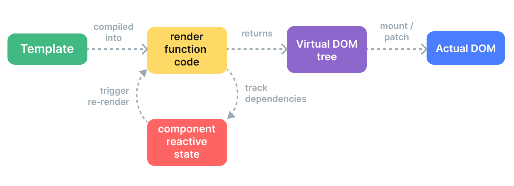

# 渲染机制

## 虚拟 DOM

虚拟 DOM 是一种以 JavaScript 对象的形式描述真实 DOM 结构的技术，它是对真实 DOM 的一种抽象表示。

下面这个 `vnode` 是一个纯 JavaScript 的对象，代表一个 `<div>` 元素。它包含创建实际元素所需的所有信息。

```js
const vnode = {
  type: 'div',
  props: {
    id: 'hello'
  },
  children: [
    /* 更多 vnode */
  ]
}
```

使用虚拟 DOM 的好处：

1. **减少直接操作真实 DOM 的次数**：操作真实 DOM 代价高（浏览器需要重排、重绘），虚拟 DOM 在内存中操作，最后统一生成最小 DOM 更新，提高渲染效率。
2. **跨平台能力**：虚拟 DOM 时抽象的描述结构，可用于浏览器、React Native、服务端等，具有很好的可移植性。

## 渲染管线

Vue 组件挂载时会发生：

1. **编译：** Vue 模板被编译为**渲染函数：**即用来返回虚拟 DOM 树的函数。
2. **挂载：** 运行时渲染器调用渲染函数，遍历返回的虚拟 DOM 树，并基于它创建实际的 DOM 节点。
3. **更新：** 当一个依赖发生变化后，副作用会重新运行，这是会创建一个更新后的虚拟 DOM 树。运行时渲染器遍历这棵树，将它与旧树进行比较，然后将必要的更新应用到真实 DOM 上去。




