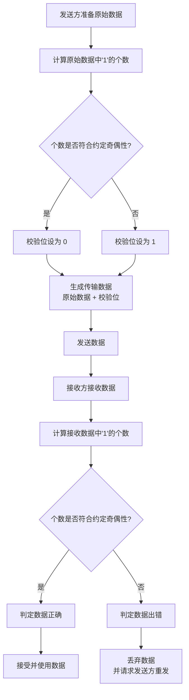

# 校验码

校验码是附加在一串数字代码末尾的一位或几位数字/字符，核心作用是检测在数据输入、传输或复制过程中是否发生了错误。常见的类型有：奇偶校验码、校验和、CRC、海明码、RS 码等。

码距：两个码字之间不同比特位的个数

## 奇偶校验码

在数据后附加 1 位，使整体“1”的个数为奇数（奇校验）或偶数（偶校验）。

1. 奇校验

若数据中 1 的数量为偶数，校验位 = 1，否则 = 0

例如原始数据 1010001，1 的个数是 3，已经是奇数，所以校验位为 0，最终发送数据为 1010001 -> 10100010

2. 偶校验

若数据中 1 的数量为奇数，校验位 = 1，否则 = 0

例如原始数据 1010001，1 的个数是 3，所以校验位为 1，最终发送数据为 1010001 -> 10100011

# 我的文档

以下是奇偶校验码的工作流程图：

